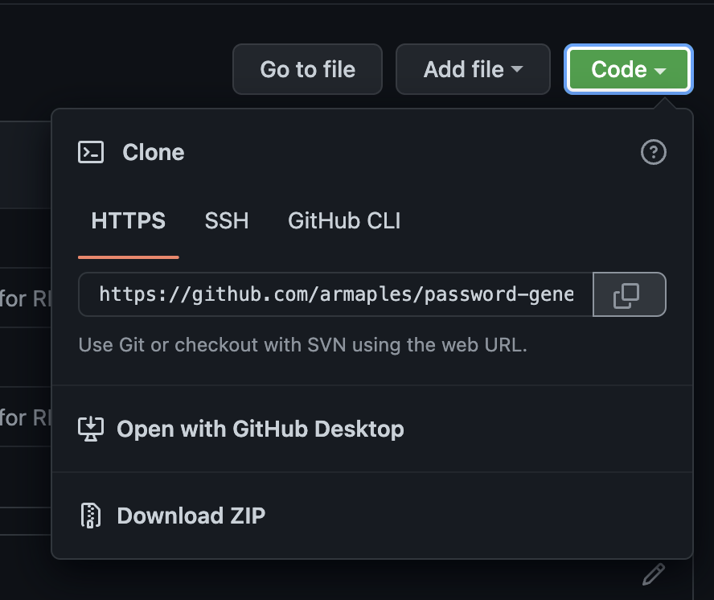
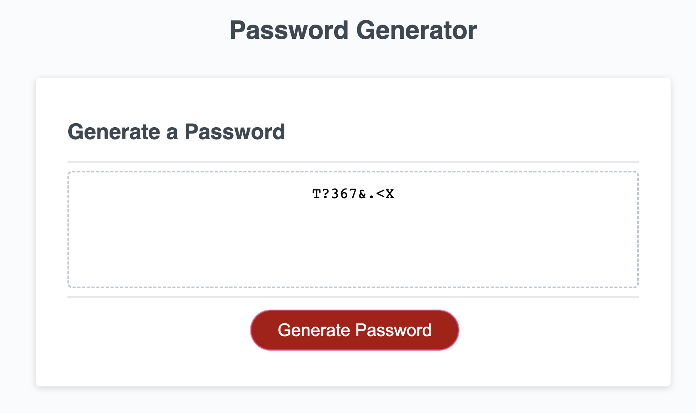

# Password Generator 

## Description

## Table of Contents

- [Installation](#installation)
- [Application Preview](#application-preview)
    - [Prompts](#prompts)
- [Languages Used](#languages-used)
- [Important Links](#important-links)
- [Credits](#credits)
- [License](#license)
    - [MIT License](#mit-license)

## Installation

- Navigate to the 'clone' button on the github repository and use either SSH or HTTPS link to clone the repository to your computer.

- On your computer, navigate to the 'password-generator' directory. 

- Open the 'index.html' file in your browser.

## Application Preview

### Prompts
When the user clicks the "Generate Password" button, a series of prompts will pop up seeking user input on the password criteria. 

The first prompt will ask how long the password should be, with a minimum of 8 characters and a maximum of 128 characters. 

If the user does not choose a number between the range of 8 and 128, the follow alert will pop up and the user will be forced to enter a number within range.

When the user chooses a number within range, the following alert will pop up as confirmation.

The user will then be asked in a series of prompts whether the password should include uppercase characters, lowercase characters, numeric characters, or special characters. 

If the user presses "OK", the character type will be included and the following alert will pop up.

If the user presses "CANCEL", the character type will not be included and the following alert will pop up.

If the user does not choose at least one type of character, the following alert will pop up and the password generation will be cancelled. 

If the user does choose at least one type of character, an alert will pop up confirming the password generation process.

Once the password is finished generating, it will appear in the textbox above the generate button.

## Languages Used

- HTML
- CSS
- Javascript

## Important Links

- [Github Repository](https://github.com/armaples/password-generator)
- [Deployed Application](https://armaples.github.io/password-generator)

## Credits
- [Professional README Guide](https://coding-boot-camp.github.io/full-stack/github/professional-readme-guide) 
- [Choose A License](https://choosealicense.com/licenses/mit/)

## License

### MIT License

Copyright (copy) 2022 - Alyssa Maples

Permission is hereby granted, free of charge, to any person obtaining a copy
of this software and associated documentation files (the "Software"), to deal
in the Software without restriction, including without limitation the rights
to use, copy, modify, merge, publish, distribute, sublicense, and/or sell
copies of the Software, and to permit persons to whom the Software is
furnished to do so, subject to the following conditions:

The above copyright notice and this permission notice shall be included in all
copies or substantial portions of the Software.

THE SOFTWARE IS PROVIDED "AS IS", WITHOUT WARRANTY OF ANY KIND, EXPRESS OR
IMPLIED, INCLUDING BUT NOT LIMITED TO THE WARRANTIES OF MERCHANTABILITY,
FITNESS FOR A PARTICULAR PURPOSE AND NONINFRINGEMENT. IN NO EVENT SHALL THE
AUTHORS OR COPYRIGHT HOLDERS BE LIABLE FOR ANY CLAIM, DAMAGES OR OTHER
LIABILITY, WHETHER IN AN ACTION OF CONTRACT, TORT OR OTHERWISE, ARISING FROM,
OUT OF OR IN CONNECTION WITH THE SOFTWARE OR THE USE OR OTHER DEALINGS IN THE
SOFTWARE.